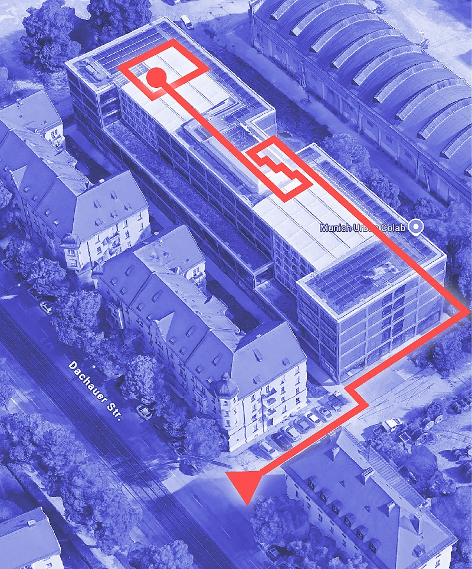

import CurvedHeadline from '../../components/CurvedHeadline.astro';
import ContactForm from '../../components/Contactform.astro';
import Button from '../../components/Button.astro';
import Popover from '../../components/Popover.astro';
import { Image } from 'astro:assets';
import mapImage from '../../img/MTKMUC_Map_light.png';

<CurvedHeadline tag="h2" direction="R2L" type="smile" offset="0" class="fill-terracotta">Lerne Tai Chi Chuan mit uns!</CurvedHeadline>

> Ma Tsu Kuen München widmet sich der Erforschung des ursprünglichen Tai Chi Chuan
> und seiner wundersamen Wirkungen auf Körper und Geist. 

<CurvedHeadline tag="h2" type="slope" direction="R2L" offset="0" class=" fill-terracotta">Warum Tai Chi Chuan?</CurvedHeadline>
<CurvedHeadline tag="h3" type="quarter" direction="R2L" offset="-20" class="fill-lazuli">What is it good for? — Absolutely everything!</CurvedHeadline>

### für Dich selbst
Mühelose Bewegung ohne Überfluss durch Entspannung und Harmonie.  
Verbinde Körper und Geist und entdecke Deine innere Gemütlichkeit.

<Button  href="./taichi#health-aspect" >Der Gesundheitsaspekt</Button>

### Selbst & Andere
Begegne Anderen jenseits von Widerstand oder Flucht. 
Entdecke Kampfkunst in kooperativen Austausch.

<Button  href="./taichi#martial-aspect">Der Kampfkunst Aspekt</Button>

### Yin & Yang
Erforsche das Wechselspiel von Yin und Yang 
- in Dir selbst,
- im Austausch mit Anderen,
- und als Teil des Ganzen.

<Button  href="./taichi#holistic-aspect">Der ganzheitliche Aspekt</Button>

<CurvedHeadline tag="h2" type="frown" direction="L2R" offset="-80" class="fill-terracotta ">Wo und Wann?</CurvedHeadline>

Montags von 17:00 Uhr bis 18:15 Uhr 

im Munich Urban Colab.

<Button href="https://g.co/kgs/bQc3c1g" target="_blank" class="">Freddie-Mercury-Straße 5, 80797 München</Button>

> Tui shou must go on!   _frei nach Freddie_

Der Kurs wird vorerst auf Spendenbasis angeboten

<Button class="py-4 my-4 px-8 rounded-full" href="#contact">Schick mir gerne eine mail, wenn du Lust hast beim Training mitzumachen</Button> 

> Invest in loss   _Cheng Man Chin_

<CurvedHeadline tag="h3" type="kicker" direction="R2L" offset="0" class="fill-lazuli">Das Ma Tsun Kuen System</CurvedHeadline>

### Der Ma Tsun Kuen Stil
Wir üben <Button href="./matsunkeun" class="bg-terracotta">Ma Tsun Kuen Tai Chi Chuan</Button>. Das ist ein komplettes System, welches alle Aspekte des Tai Chi Lernens enthält:
- Grundlagen Übungen,
- Formen,
- Partner Übungen und
- I Qi Kung.

Für Informationen über meine Lehrer und über Meister Ma Tsun Kuen geht es <Button href="./about"> hier lang.</Button>

<CurvedHeadline tag="h2" type="wave" direction="R2L" offset="-20" class=" fill-terracotta">For whom ? For everybody !</CurvedHeadline>

**Bist du Anfänger? Willkommen!** 
Starte deine Tai Chi Reise mit uns! Ma Tsun Kuen TCC beinhaltet ein komplettes Trainings System, und die Inhalte bauen langsam auf einander auf. Man kann jederzeit einsteigen, die Grundlagen werden laufend wiederholt.

**Möchtest du an frühere Tai Chi Erfahrung anknüpfen? Willkommen!** 
Du wirst Dich mit diesem Stil sicherlich schnell wie zu Hause fühlen. Wie jeder Tai Chi Stil basiert er auf den <Button href="./taichi#Tai-Chi-Prinzipien">Tai Chi Prinzipien</Button> und die Langform benutzt die gleichen Bilder wie Yang Stil Langform.

**Menschen jeden Alters können Tai Chi üben — einer der vielen Vorteile dieses Trainings.** 

